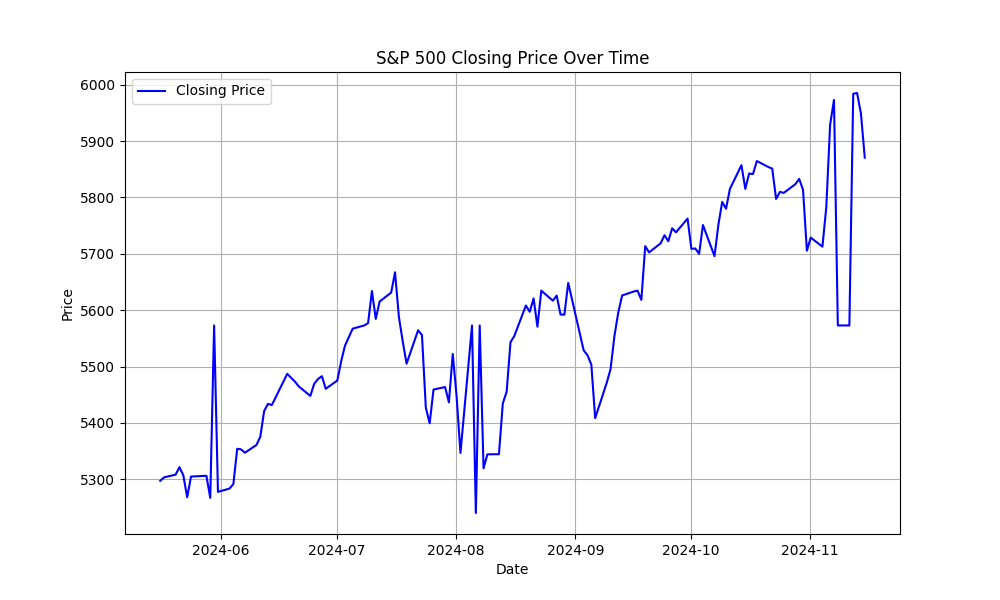
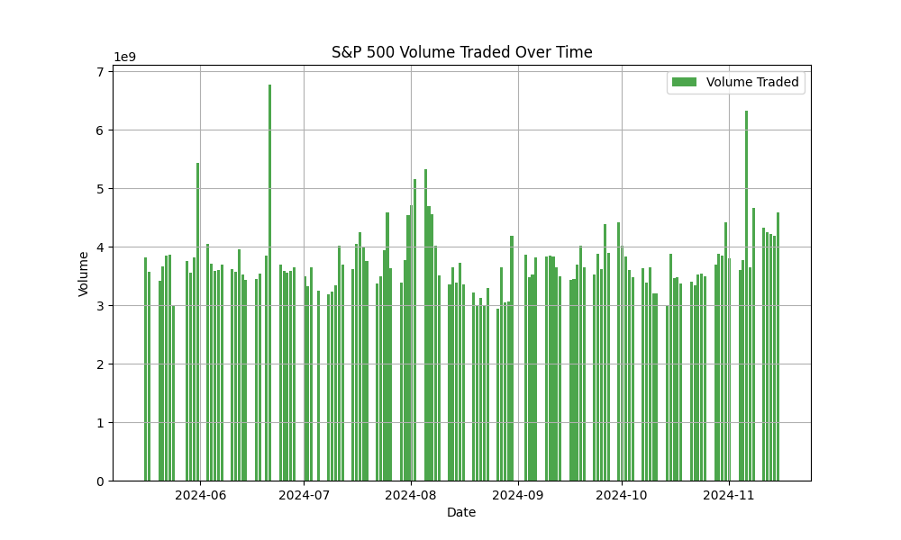

# Financial Benchmark Data Validation and Reconciliation

## Objective
This project simulates the validation and reconciliation of financial benchmark data from multiple vendors. It demonstrates the use of Python and SQL to clean and consolidate data, ensuring data integrity and accuracy. Additionally, it includes data visualization and anomaly detection to provide actionable insights.

---

## Features
- **Data Validation**: Identifies and handles missing values, inconsistencies, and outliers in financial benchmark data.
- **Data Reconciliation**: Merges data from multiple sources to create a consistent "golden" dataset.
- **Anomaly Detection**: Implements alerts for anomalies, such as missing fields or unusual trends.
- **Data Coverage Analysis**: Evaluates the completeness and accuracy of the reconciled data.
- **Visualization**: Provides clear insights using Matplotlib with time-series plots and volume analysis.

---

## Technologies Used
- **Programming Languages**: Python
- **Libraries**:
  - `pandas` (Data Manipulation)
  - `Matplotlib` (Visualization)
  - `NumPy` (Statistical Analysis)
- **Database**: SQLite for query-based data validation
- **Version Control**: Git and GitHub

---

## How to Run

### 1. Prerequisites
- Install Python 3.x on your system.
- Clone this repository:
  ```bash
  git clone https://github.com/yourusername/financial-benchmark-validation.git
  cd financial-benchmark-validation
  ```
- Set up a virtual environment and install the required libraries:
  ```bash
  python3 -m venv venv
  source venv/bin/activate
  pip install -r requirements.txt
  ```

### 2. Running the Scripts
1. **Fetch Financial Data**:
   - Run `fetch_data.py` to collect benchmark data.
     ```bash
     python3 fetch_data.py
     ```

2. **Simulate Data Discrepancies**:
   - Use `simulate_discrepancies.py` to introduce errors for reconciliation.
     ```bash
     python3 simulate_discrepancies.py
     ```

3. **Validate and Reconcile Data**:
   - Run `validate_and_reconcile.py` to clean and consolidate the data.
     ```bash
     python3 validate_and_reconcile.py
     ```

4. **Visualize the Data**:
   - Generate visualizations using `visualize_data.py`.
     ```bash
     python3 visualize_data.py
     ```

---

## Project Structure
```
benchmark_project/
├── data/
│   ├── raw/             # Raw data fetched from APIs
│   ├── simulated/       # Simulated datasets with discrepancies
│   ├── outputs/         # Final reconciled data
├── visualizations/      # Saved plots
├── scripts/
│   ├── fetch_data.py    # Fetches financial data
│   ├── simulate_discrepancies.py  # Introduces errors to datasets
│   ├── validate_and_reconcile.py # Cleans and reconciles data
│   ├── visualize_data.py          # Generates visualizations
└── README.md            # Project documentation
```

---

## Sample Visualizations
### 1. Closing Price Over Time:


### 2. Volume Traded Over Time:


---

## Acknowledgments
This project was developed to align with the responsibilities of an ADSO Analyst, such as data validation, reconciliation, and analysis of benchmark data. Used **ChatGPT-4** by OpenAI as a tool for project structure and scripting.

---

## Future Enhancements
- Simulate multi-vendor data and perform advanced reconciliation.
- Add SQL automation for anomaly detection and validation.
- Build a dashboard for real-time data quality monitoring.
