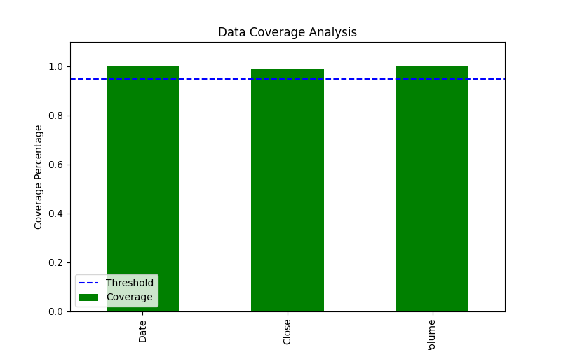

# Financial Benchmark Data Validation and Reconciliation

## Objective
This project simulates the validation and reconciliation of financial benchmark data from multiple vendors. It demonstrates the use of Python and SQL to clean and consolidate data, ensuring data integrity and accuracy. Additionally, it includes data visualization, anomaly detection, and data coverage analysis to provide actionable insights.

---

## Features
- **Data Validation**: Identifies and handles missing values, inconsistencies, and outliers in financial benchmark data.
- **Data Reconciliation**: Merges data from multiple sources to create a consistent "golden" dataset.
- **Anomaly Detection**: Implements alerts for anomalies, such as missing fields or unusual trends.
- **Data Coverage Analysis**: Evaluates the completeness and accuracy of the reconciled data and generates a coverage report.
- **Visualization**: Provides clear insights using Matplotlib with time-series plots and volume analysis.

---

## Technologies Used
- **Programming Languages**: Python
- **Libraries**:
  - `pandas` (Data Manipulation)
  - `Matplotlib` (Visualization)
  - `NumPy` (Statistical Analysis)
  - `sqlite3` (SQL Automation)
- **Database**: SQLite for query-based data validation
- **Version Control**: Git and GitHub

---

## How to Run

### 1. Prerequisites
- Install Python 3.x on your system.
- Clone this repository:
  ```bash
  git clone https://github.com/yourusername/financial-benchmark-validation.git
  cd financial-benchmark-validation
  ```
- Set up a virtual environment and install the required libraries:
  ```bash
  python3 -m venv venv
  source venv/bin/activate
  pip install -r requirements.txt
  ```

### 2. Running the Scripts
1. **Fetch Financial Data**:
   - Run `fetch_data.py` to collect benchmark data.
     ```bash
     python3 fetch_data.py
     ```

2. **Simulate Data Discrepancies**:
   - Use `simulate_discrepancies.py` to introduce errors for reconciliation.
     ```bash
     python3 simulate_discrepancies.py
     ```

3. **Reconcile Vendor Data**:
   - Use `reconcile_vendors.py` to merge multi-vendor data into a reconciled dataset.
     ```bash
     python3 reconcile_vendors.py
     ```

4. **Alert System**:
   - Run `alert_system.py` to detect missing data and outliers.
     ```bash
     python3 alert_system.py
     ```

5. **Data Coverage Analysis**:
   - Run `data_coverage_analysis.py` to generate a coverage report and visualization.
     ```bash
     python3 data_coverage_analysis.py
     ```

---

## Sample Outputs

### 1. Coverage Report:
```
        Coverage  Meets Requirement
Date    1.000000               True
Close   0.992188               True
Volume  1.000000               True
```

### 2. Coverage Chart:


---

## Client Simulation
**Client Scenario**:
- Client A requires validated S&P 500 data for the past 6 months, with a minimum of 95% data completeness for the `Date`, `Close`, and `Volume` fields.
- The coverage analysis confirms that all requirements are met, ensuring high-quality data for trading strategy development.

---

## Future Enhancements
- Simulate multi-vendor data and perform advanced reconciliation.
- Add SQL automation for anomaly detection and validation.
- Build a dashboard for real-time data quality monitoring.
